# Predicting Loan Approval using Logistic Regression Analysis

## Context

Dream Housing Finance company deals in all kinds of home loans. They have presence across all urban, semi urban and rural areas. Customer first applies for home loan and after that company validates the customer eligibility for loan.
Company wants to automate the loan eligibility process (real time) based on customer detail provided while filling online application form. These details are Gender, Marital Status, Education, Number of Dependents, Income, Loan Amount, Credit History and others. To automate this process, they have provided a dataset to identify the customers segments that are eligible for loan amount so that they can specifically target these 

## Feature Description

| Column Name         | Description                               |
|---------------------|-------------------------------------------|
| Loan_ID             | Unique Loan ID                            |
| Gender              | Male/Female                               |
| Married             | Applicant married (Y/N)                   |
| Dependents          | Number of dependents                      |
| Education           | Applicant Education (Graduate/Under Graduate) |
| Self_Employed       | Self-employed (Y/N)                       |
| Applicant Income    | Applicant income                          |
| Coapplicant Income  | Coapplicant income                        |
| Loan Amount         | Loan amount in thousands                  |
| Loan_Amount_Term    | Term of loan in months                     |
| Credit_History      | Credit history meets guidelines           |
| Property_Area       | Urban/Semi Urban/Rural                     |
| Loan_Status         | (Target) Loan approved (Y/N)              |

#### *Datasource: https://www.kaggle.com/datasets/devzohaib/eligibility-prediction-for-loan*

## Project Goal
Using the provided dataset, our study will aim to determine which particular customer profiles are more likely to receive loan approval. Subsequently, we will develop a machine learning model using Logistic Regression, which will automate the binary classification of loan status (approved/denied).

## Project Strucuture
1. Import libraries & Load Dataset
2. Overview of Data
3. Data Cleansing
    - 3-1. Remove Duplicates
    - 3-2. Standardization of Headers
    - 3-3. Handling Null Values
4. Exploratory Data Analysis (EDA)
    - 4-1. Analysis of Numeric Features
    - 4-2. Analysis of Features Relative to the Target Variable
6. Logistic Regression Analysis
    - 5-1. Data Processing
    - 5-2. Data Encoding
    - 5-3. Splitting the Data and Fitting the Model
    - 5-4. Model Building - Logistic Regression
    - 5-5. Model Validation - Confusion Matrix

*In this document, I present a summary of the key insights derived from the EDA and Logistic Regression model for loan approval prediction. Additionally, I provide the model's score and validation results using a Confusion Matrix. For more detailed code snippets and analysis, please refer to the "loan.ipynb" file.*

## Analysis of Numeric Features

### Correlation

- **'total_income'** and **'loan_amount'** are the most correlated numerical features, with a correlation coefficient of 68%.It looks like as higher income, high loan amount request.

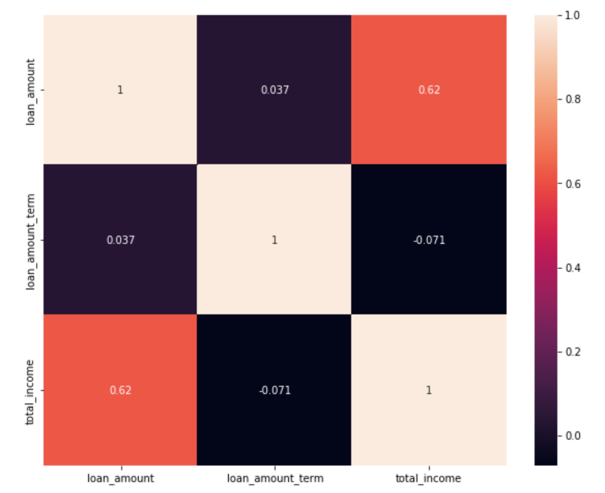

### Distribution

- **Total_income**: The mean total income is 7024, indicating a normal distribution with a slight skew to the right. A considerable number of outliers are observed in this feature.
- **Loan_amount**: The average loan amount is 146, which exhibits a near-normal distribution, albeit slightly right-skewed.
- **Loan_amount_term**: The average loan term is 342 days. This feature exhibits a normal distribution with most loan terms concentrated between 300-400 days.
- **Credit_history**: This is a binary feature that only takes 'Yes' or 'No' values.
- 
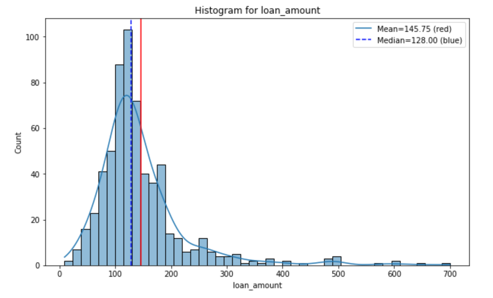
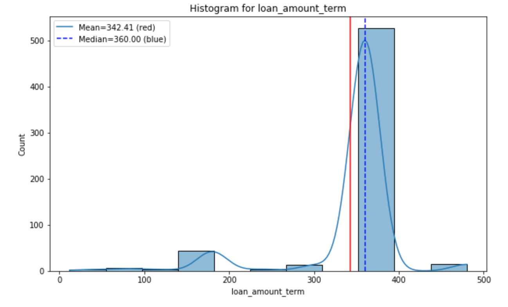
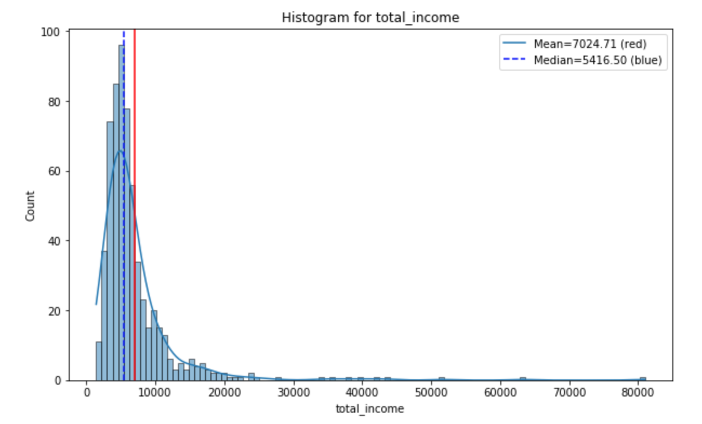

### Outliers

- A substantial number of outliers have been identified in almost all numerical features. It could be beneficial to investigate how profiles with outliers differ from the rest in terms of loan approval. This will be further explored in the EDA.
- A significant number of outliers were identified in **'loan_amount' (6.68%), 'loan_amount_term' (14.33%)**, and **'total_income' (8.14%)**. Given the high frequency of outliers, it may not be advisable to remove them before model training as this could lead to significant data loss. An alternative strategy could involve binning these features and converting them into categorical variables for use in model training.

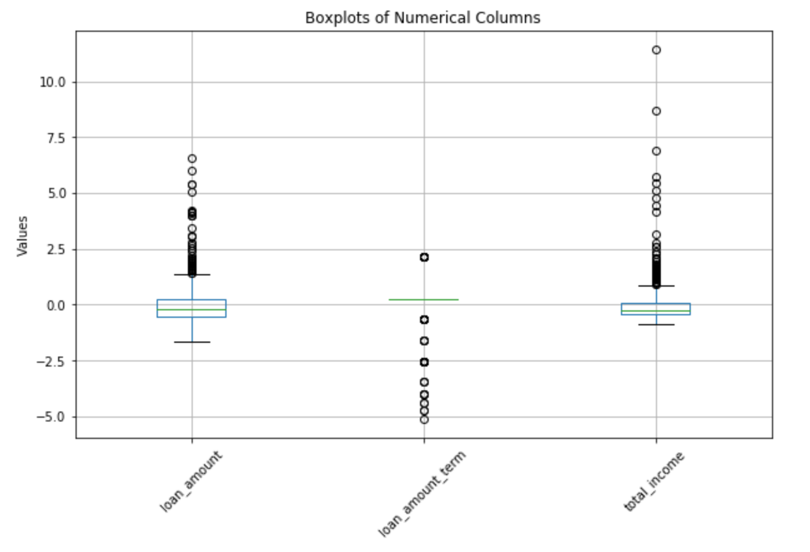

## Analysis of Features Reletive to the Target Variable

### Target variable(laon status)
The follwoing target feature appears the imbalance in data (more yes than No)

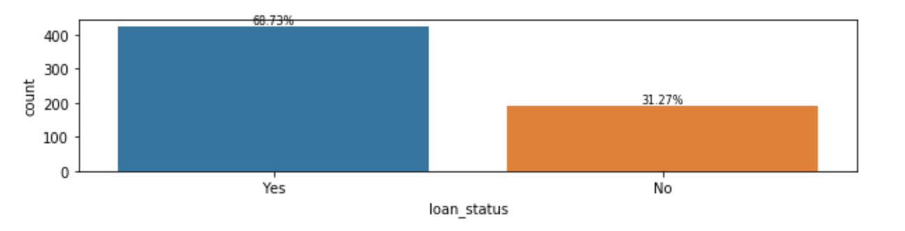

### Analysis of Numeric Features Relative to the Target Variable

We undertook an analysis to explore potential relationships between numeric features and the target variable. The goal was to identify any significant insights that could emerge when comparing the distribution of these features, considering both the presence and absence of outliers. However, despite rigorous examination, it proved challenging to ascertain if these numeric features wielded considerable influence over loan approval decisions.

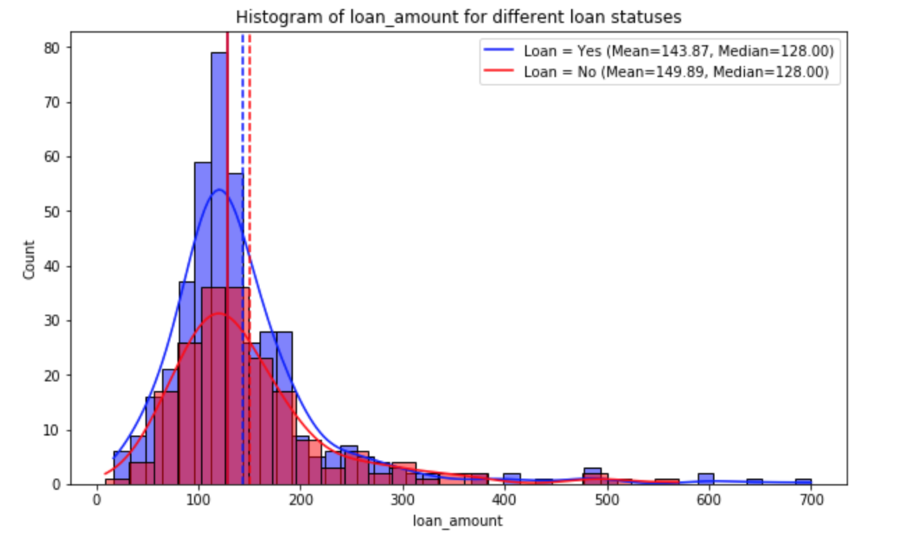
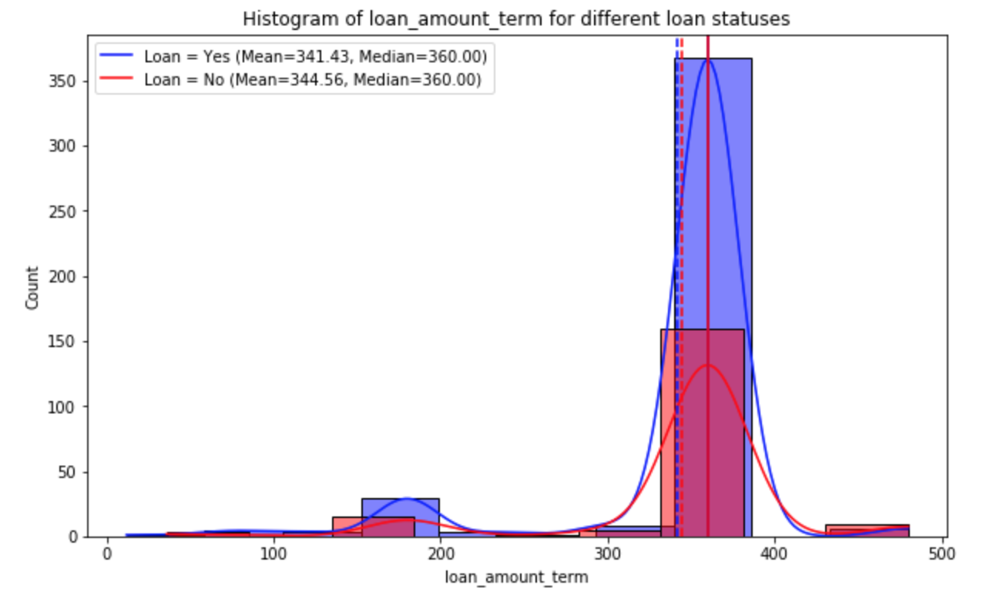
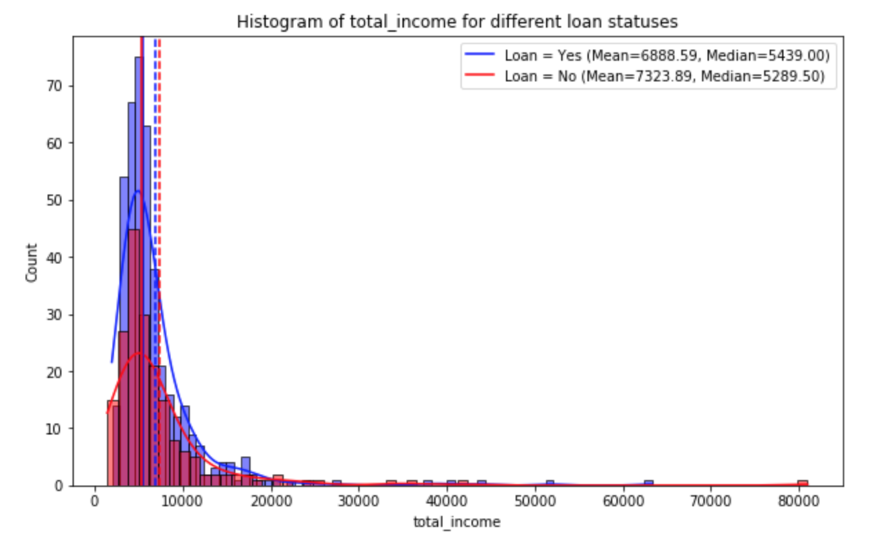
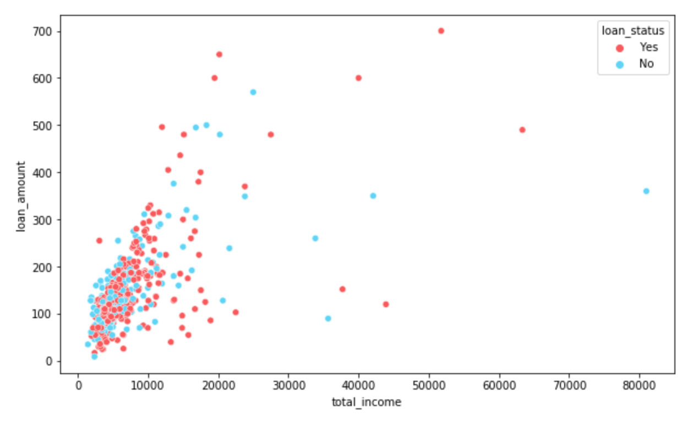

### Analysis of Categorical Features Relative to the Target Variable

While the dataset shows certain imbalances in various categorical features, the following is a rough interpretation of the feature analysis:

- **Gender**: The chance of loan approval doesn't appear to display substantial disparity between females and males, suggesting that gender may not be a significant factor in the loan approval decision.
- **Marital Status**: Married applicants have a slightly higher likelihood (71%) of receiving loan approval compared to those who are not married (63%). However, the correlation seems to have minimal impact on loan approval.
- **Dependents**: Applicants with two dependents seem to have a slightly increased probability of loan approval.
- **Education**: Graduates demonstrate a better chance of securing loan approval (71%) than non-graduates (61%).
- **Employment Status**: The employment status of the applicant doesn't appear to significantly impact the approval of loans.
- **Credit History**: The availability of credit history has a substantial impact on loan approval, indicating that having a credit history is critical for loan approval (Yes - 79%, No - 8%).
- **Property Area**: Based on proportions, living in a semi-urban area may slightly enhance the probability of loan approval, although the significance seems minimal.
- **Loan Amount Range**: The most frequently approved loan amounts are between 400 and 500 (89%), and 0 and 100 (74%). Requesting a loan within these ranges could possibly enhance the chances of approval.
- **Loan Term Range**: Regarding the term of repayment, ranges of 0-100 days (89%), 200-300 days (79%), and 100-200 days (77%) are commonly associated with loan approval.
- **Income Range**: The influence of income on loan approval seems to be insignificant. However, it is worth noting that the income range of 2000+ exhibits the lowest loan approval rate. It is important to consider that the total count within this income range is relatively small, making it difficult to draw meaningful insights.

In conclusion, applicants who are married, have two dependents, are graduates, possess a credit history, reside in a semi-urban area, and seek a loan amount between 400-500 or 0-100 for a term of 0-300 days are more likely to receive loan approval. Importantly, the availability of credit history is the most critical factor in obtaining loan approval.

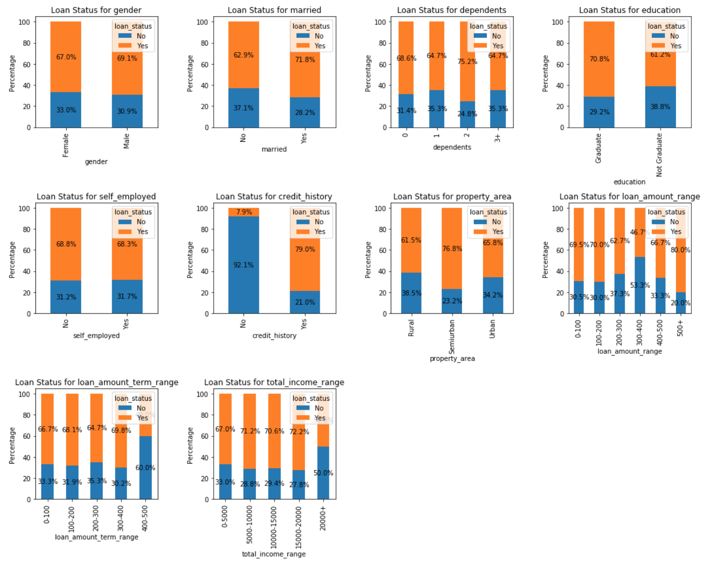

## Logistic Regresion Analysis

### Model Building
For model building in this project, a logistic regression algorithm was employed. The following steps were taken:

- **Data Preparation**: The dataset was prepared by excluding the 'loan_id' column and dropping irrelevant categorical columns ('loan_amount_range', 'loan_amount_term_range', 'total_income_range'). The resulting dataframe was assigned to df_modeling.

- **Feature Encoding**: Categorical features were one-hot encoded using the pd.get_dummies() function to convert them into numerical values.

- **Data Splitting**: The dataset was split into training and testing sets using the train_test_split() function, with 80% of the data assigned to training (X_train, y_train) and 20% to testing (X_test, y_test).

- **Model Training**: A logistic regression model was initialized with LogisticRegression(random_state=42) and fitted using the training data (X_train, y_train) using the fit() function.

### Evaluation
The model's performance was evaluated using the following metrics:

- **Accuracy Score**: The accuracy classification score was computed using the score() function on the testing data (X_test, y_test). This score represents the proportion of correctly predicted loan statuses.

- **Confusion Matrix**: The confusion matrix was calculated using the confusion_matrix() function on the testing data (y_test, predictions). It provides a detailed breakdown of the model's predictions and actual loan statuses.

### Results
I utilized an array of data cleaning techniques to train a logistic regression model, with the goal of identifying those that delivered the highest accuracy. The outcomes of these separate procedures are outlined subsequently. Considering the slight imbalance present in the dataset, the data balancing method did not significantly improve accuracy; in fact, the enhancement was relatively low. When handling outliers, the equal width binning strategy was found unsuitable because it failed to adequately represent the data distribution. Consequently, Methods 3 and 4 emerge as more fitting models for predicting loan approval.

